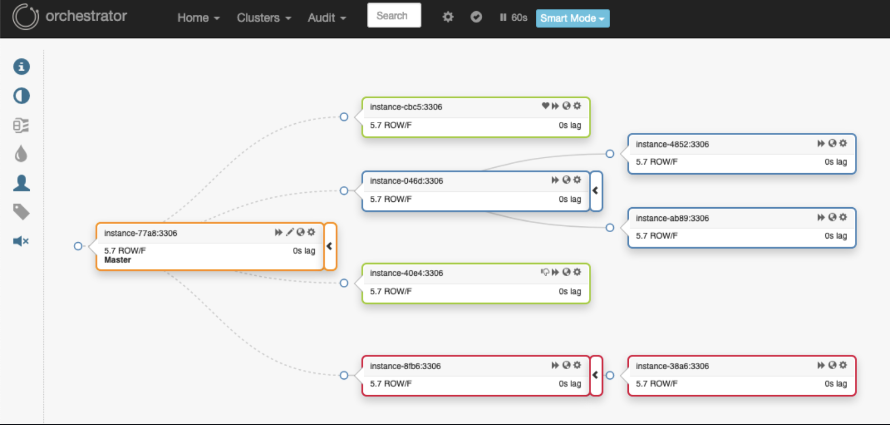

# Orchestrator

**orchestrator** 是一个MySQL高可用和复制管理工具。作为服务运行，并提供命令行访问、HTTP API和Web界面。
orchestrator支持：

**Discovery发现**

    orchestrator主动爬取您的拓扑并映射它们。它读取基本的MySQL信息，如复制状态和配置。
    它为您提供了灵活的拓扑可视化，包括复制问题，即使在遇到故障时也是如此。
    
**Refactoring重构**

    orchestrator了解复制规则。它了解binlog文件：Position位点、GTID、Pseudo-GTID伪GTID、binlog服务器。
    
    重构复制拓扑可以是将复制副本拖放到另一个主机下。移动副本是安全的：orchestrator将拒绝非法重构尝试。
    细粒度控制是通过各种命令行选项实现的。

**Recovery恢复**

    orchestrator使用整体方法来检测主设备和中间主设备故障。
    根据从拓扑本身获得的信息，它可以识别各种故障场景。
    
    可配置，它可以选择执行自动恢复（或允许用户选择手动恢复的类型）。在orchestrator内部实现中间主恢复。
    主故障切换由故障前/故障后挂钩支持。
    恢复过程利用orchestrator对拓扑及其执行重构能力的理解。它基于状态而不是配置：orchestrator通过在恢复时调查/评估拓扑来选择最佳恢复方法。

**The interface接口**

    orchestrator支持：

    * 命令行界面（喜欢调试消息，控制自动脚本）
    * Web API（HTTP获取访问）
    * 网络接口，一个光滑的。
    

**Additional perks额外待遇**

    * 高可用
    * 受控主接管
    * 手动故障切换
    * 故障转移审核
    * 经审计的业务
    * 伪GTID
    * 数据中心/物理位置感知
    * MySQL池关联
    * HTTP安全/身份验证方法
    * 还有一个orchestrator-mysql Google groups论坛，讨论与orchestrator相关的主题
    * 更多...
    
阅读Orchestrator文档（https://github.com/openark/orchestrator/tree/master/docs）

由Shlomi Noach撰写：

* 2020年 - 在 https://github.com/openark/orchestrator
* 2016-2020年在GitHub ashttps://github.com/github/orchestrator
* 2015年在Booking.com上作为https://github.com/outbrain/orchestrator
* 2014年在Outbrain ashttps://github.com/outbrain/orchestrator
    
**Related projects相关项目**

* Orchestrator Puppet模块：https://github.com/github/puppet-orchestrator-for-mysql
* Orchestrator Chef Cookbook (1)：https://github.com/silviabotros/chef-orchestrator
* Orchestrator Chef Cookbook (2)：https://supermarket.chef.io/cookbooks/orchestrator
* 基于Orchestrator API的Nagios/Icinga检查：https://github.com/mcrauwel/go-check-orchestrator
* Orchestrator API的轻型Python包装器：https://github.com/stirlab/python-mysql-orchestrator

**Developers开发者**

    阅读开发者文档（https://github.com/openark/orchestrator/blob/master/docs/developers.md），开始开发Orchestrator。谢谢你的关注！
    
**License许可证**

    orchestrator在Apache 2.0许可下是免费的、开源的。
    
    