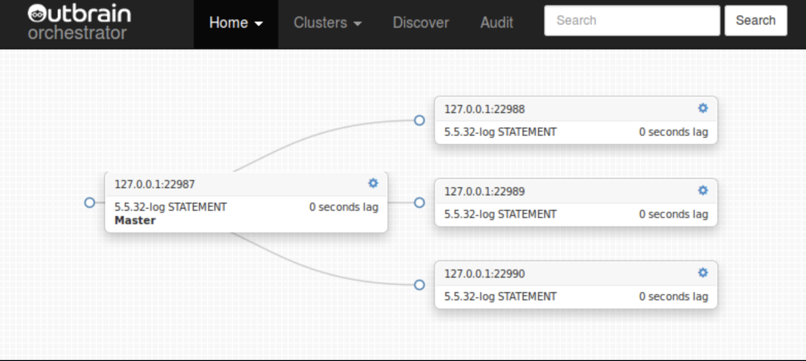

# 关于 Orchestrator

**Orchestrator**是一种MySQL复制拓扑HA、管理和可视化工具，允许：

* Discovery 发现

    orchestrator主动爬网您的拓扑并映射它们。它读取基本的MySQL信息，如复制状态和配置。
    它提供了对拓扑（包括复制问题）的流畅可视化，即使在遇到故障时也是如此。

* Refactoring 重构

    orchestrator了解复制规则。它了解binlog文件：position、GTID、Pseudo-GTID、binlog服务器。
    
    重构复制拓扑可以是将复制副本拖放到另一个主机下。移动副本变得安全：orchestrator将拒绝非法重构尝试。
    
    查找粒度控制是通过各种命令行选项实现的。

* Recovery 恢复

    Orchestrator使用整体方法来检测master设备和intermediate master设备故障。根据从拓扑本身获得的信息，它可以识别各种故障场景。
    可配置，它可以选择执行自动恢复（或允许用户选择手动恢复的类型）。在orchestrator内部实现Intermediate master恢复。Master故障切换由pre/post故障前/故障后hooks支持。

    恢复过程利用orchestrator对拓扑及其执行重构能力的理解。它基于state状态而不是配置：orchestrator通过在 恢复时调查/评估拓扑 来选择最佳恢复方法。

    
* Credits，attributions 信誉，属性

    作者：Shlomi Noach（https://github.com/shlomi-noach）

    这个项目最初是由Outbrain发起的(https://www.outbrain.com/)，Outbrain从一开始就以开源的形式发布了它。
    我们希望感谢Outbrain对开源软件的支持，以及他们进一步愿意为这个项目的成功而合作。
    
    该项目后来在Booking.com上开发，该公司非常慷慨地发布了对开放源码的进一步修改。
    
    目前，该项目正在GitHub开发。我们将继续保持开放和支持。
    
    该项目接受拉请求并鼓励它们。感谢您的任何改进/帮助！
    
    此Wiki的其他合作者和贡献者：
    
    * 格里尔(https://github.com/grierj)
    * 其他了不起的人

    