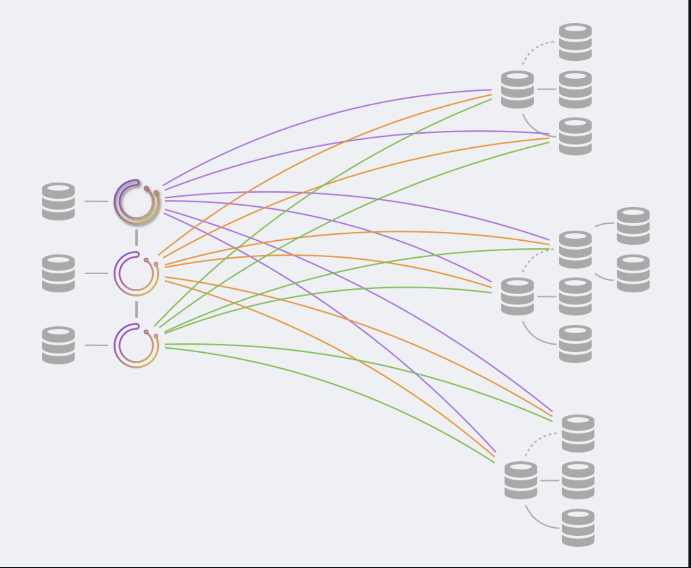

# Orchestrator部署：raft

本文介绍raft上orchestrator(https://hub.fastgit.org/openark/orchestrator/blob/master/docs/raft.md)的部署。

这是对一般部署(https://hub.fastgit.org/openark/orchestrator/blob/master/docs/deployment.md)文档的补充。

## 后端数据库

您可以选择使用MySQL和SQLite。请参阅后端配置(https://hub.fastgit.org/openark/orchestrator/blob/master/docs/configuration-backend.md)。

* 对于MySQL：

    * 后端服务器将是独立的。没有复制设置。每个orchestrator节点将与其自己的专用后端服务器交互
    * 您必须具有1:1映射编排器：MySQL。
    * 建议：在同一台机器上运行orchestrator及其专用MySQL服务器。
    * 确保为每个后端节点上的orchestrator用户授予权限。
    
* 对于SQLite：

    * SQLite与orchestrator捆绑在一起。
    * 确保orchestrator用户可以写入SQLite3DataFile。

## 高可用性

    orchestrator通过使用raft获得高可用性。您不需要考虑后端数据库的高可用性。

## 部署内容：服务
    
* 将orchestrator服务部署到服务盒上。正如所建议的，您可能希望将orchestrator服务和MySQL服务放在同一个框中。
如果使用SQLite，则无需其他操作。

* 考虑在服务箱的顶部添加代理；代理将所有通信重定向到leader节点。有一个且只有一个leader节点，状态检查端点为/api/leader-check。

    * 客户端只能与健康的raft节点交互。
        * 最简单的方法就是与领导者互动。设置代理是确保这一点的一种方法。请参见代理：leader部分。(https://hub.fastgit.org/openark/orchestrator/blob/master/docs/raft.md#proxy-leader)
        * 否则，所有正常的raft节点都会将您的请求反向代理给leader。请参见代理：健康raft节点部分。(https://hub.fastgit.org/openark/orchestrator/blob/master/docs/raft.md#proxy-healthy-raft-nodes)

* 任何内容都不应直接与后端数据库交互。只有leader能够与其他raft节点协调对数据的更改。

* orchestrator节点在DefaultRaftPort上相互通信。此端口应向所有orchestrator节点开放，其他任何人都不需要访问此端口。

## 部署内容：客户端

要从shell/automation/scripts与orchestrator交互，您可以选择：

* 直接与HTTP API交互

    * 您只能与leader互动。实现这一点的一个好方法是使用代理。

* 使用orchestrator-client脚本。

    * 在希望与orchestrator交互的任何框上部署orchestrator-client。
    * 在这些框上创建并编辑/etc/profile.d/orchestrator-client.sh，内容如下：

        ORCHESTRATOR_API=”http://your.orchestrator.service.proxy:80/api"
    或
        ORCHESTRATOR_API="http://your.orchestrator.service.host1:3000/api http://your.orchestrator.service.host2:3000/api http://your.orchestrator.service.host3:3000/api"
    
    在后一种情况下，您将提供所有orchestrator节点的列表，orchestrator客户端脚本将自动确定谁是leader。使用此设置，您的自动化将不需要代理（尽管您可能仍希望为web界面用户使用代理）。

    确保使用chef/puppet/任何ORCHESTRATOR_API值，以使其适应环境中的变化。

* orchestrator命令行客户端将拒绝运行给定的raft设置，因为它直接与基础数据库交互，不参与raft共识，因此无法确保所有raft成员都能看到它的更改。

    * 幸运的是，orchestrator-client提供了与命令行客户端几乎相同的接口。
    * 您可以强制命令行客户端通过--ignore-raft-setup安装程序运行。这是你冒的"我知道我在做什么"的风险。如果您选择使用它，那么连接到leader的后端数据库就更有意义了。

## Orchestrator 服务

    如前所述，单个orchestrator节点将承担领导角色。只有领导者才会：
    
        * 运行恢复
        
    但是，所有节点将：
    
        * 发现（探测）您的MySQL拓扑
        * 运行故障检测
        * 注册自己的健康检查
        
    Non-leader节点必须 NOT：
    
        * 运行任意命令（例如relocate, begin-downtime）
        * 根据人工请求运行恢复。
        * 为客户端HTTP请求提供服务（但某些endpoints端点（如负载平衡器和运行状况检查）是有效的。

## 一个直观的例子

在上面的示例中，raft集群中有三个orchestrator节点，每个节点使用自己的专用数据库（MySQL或SQLite）。orchestrator节点相互通信。
只有一个orchestrator节点是leader。
所有orchestrator节点都探测整个MySQL组。每个MySQL服务器由每个raft成员探测。

## orchestrator/raft操作场景
##### 节点崩溃

启动节点，启动MySQL服务（如果适用），启动orchestrator服务。orchestrator服务应加入raft组，获取最近的快照，跟踪raft复制日志，并正常继续。

##### 设置新节点/重新设置节点

使后端数据库完全为empty/missing.

如果是SQLite，则无需执行任何操作。该节点只需加入raft组，从其中一个活动节点获取快照，赶上raft日志并正常运行。

如果是MySQL，将尝试相同的操作。但是，MySQL服务器必须具有orchestrator操作的权限（https://github.com/openark/orchestrator/blob/master/docs/configuration-backend.md#mysql-backend-db-setup）。
因此，如果这是一个全新的服务器，这些特权可能不存在。
例如，我们的puppet设置定期确保在MySQL服务器上设置权限。因此，在配置新服务器时，下一次puppet运行将为orchestrator设置权限。
puppet还确保orchestrator服务正在运行，因此，在等待一段时间后，orchestrator可以自动加入组。

##### 克隆是有效的

如果您选择这样做，还可以通过使用您最喜欢的backup/restore 或 dump/load 方法克隆现有后端数据库来配置新框。
这是完全有效的，尽管不是必需的。

* 如果是MySQL，请运行backup/restore，无论是逻辑备份还是物理备份。
* 如果是SQLite，请运行.dump+restore，请参阅10。将整个数据库转换为ASCII文本文件。（https://sqlite.org/cli.html）
* 启动orchestrator服务。它应该赶上raft复制日志并加入raft集群。

##### 替换节点

假设节点：["node1"、"node2"、"node3"]，并且您希望用nodeX替换node3。

* 您可以取下节点3，只要节点1和节点2良好，raft集群将继续工作。
* 创建nodeX box框。生成后端数据库数据（见上文）。
* 在node1上，node2和nodeX重新配置节点：["node1"、"node2"、"nodeX"]。
* 在nodeX上启动orchestrator。它将被拒绝，并且不会加入集群，因为node1和node2尚未意识到该更改。
* 在节点1上重新启动orchestrator。
* 在node2上重新启动orchestrator。
    * 此时，所有三个节点都应该形成一个快乐的集群。

