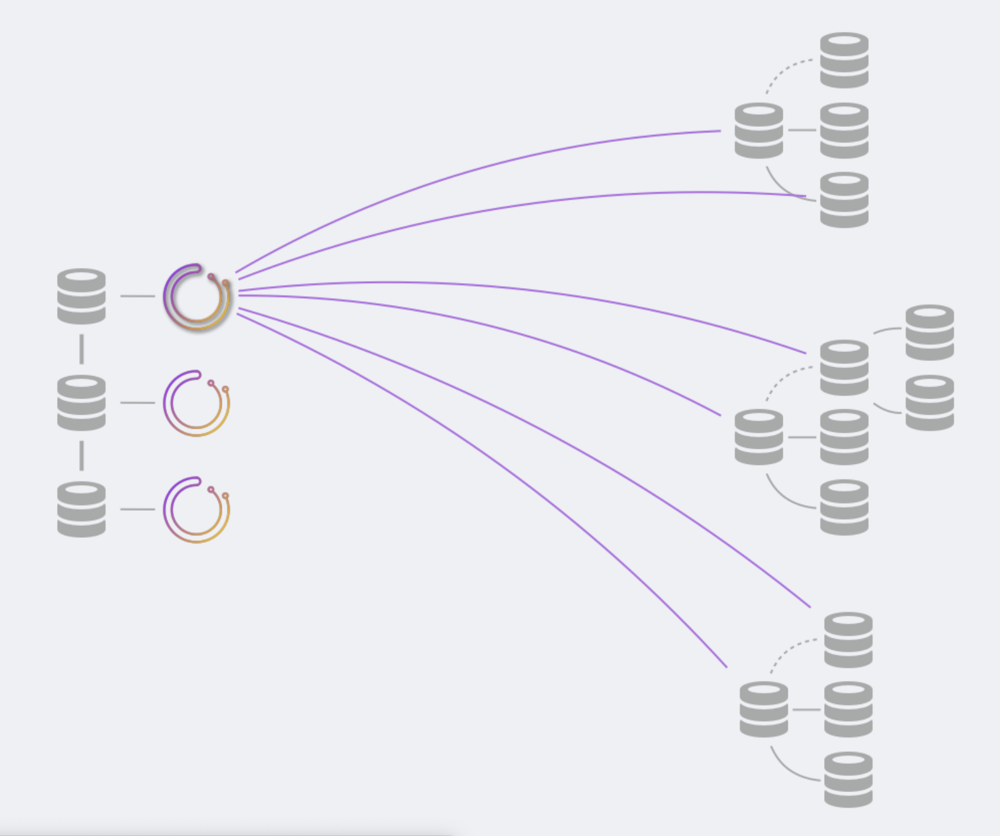

# Orchestrator 部署: 共享后端

本文介绍共享后端数据库的部署。请参阅各种后端数据库设置的高可用性。（https://hub.fastgit.org/openark/orchestrator/blob/master/docs/high-availability.md）

这是对一般部署(https://hub.fastgit.org/openark/orchestrator/blob/master/docs/deployment.md)文档的补充。

#### 共享后端

您需要设置一个共享后端数据库。这可以是同步复制（Galera/XtraDB Cluster/InnoDB Cluster）以实现高可用性，也可以是主副本设置等。

后端数据库具有拓扑的状态。orchestrator本身几乎是无状态的，并且信任后端数据库中的数据。

在共享后端设置中，多个orchestrator服务都将与同一后端通信。

* 对于同步复制，建议如下：

    * 配置multi-writer模式（MySQL集群中的每个节点都是可写的）
    * 在orchestrator服务和MySQL节点之间有1:1的映射：每个orchestrator服务都与自己的节点通信。

* 对于主副本（异步和半同步），请执行以下操作：

    * 配置所有orchestrator节点以访问相同的后端数据库（主数据库）
    * 您还可以选择使用自己的负载平衡器将流量定向到所述主机，在这种情况下，配置所有orchestrator节点以访问代理。

#### MySQL后端设置和高可用性

设置后端数据库由您负责。此外，orchestartor成员不吃自己的狗粮，也无法在自己的后端数据库上恢复故障。
例如，您需要处理添加Galera节点或管理代理运行状况检查等问题。

#### 部署内容：service服务

将orchestrator服务部署到服务盒上。部署多少服务boxes箱取决于您的可用性需求。(https://github.com/openark/orchestrator/blob/master/docs/high-availability.md)

    * 在同步复制共享后端设置中，这些很可能就是MySQL boxes框，采用1:1映射。

考虑在服务boxes箱的顶部添加代理；理想情况下，代理将所有流量重定向到leader节点。
有一个且只有一个leader节点，状态检查端点为/api/leader-check。将直接流量任何健康的服务都是可以的。
由于所有orchestrator节点都与相同的共享后端数据库通信，因此可以从一个服务节点操作某些操作，而从另一个服务节点操作其他操作。
放置内部锁是为了避免运行相互矛盾或干扰的命令。

#### 部署内容：client客户端

要从shell/automation/scripts与orchestrator交互，您可以选择：

* 直接与HTTP API交互
* 使用orchestrator-client脚本（https://githun.com/openark/orchestrator/blob/master/docs/orchestrator-client.md）。

    * 在希望与orchestrator交互的任何框上部署orchestrator客户端。
    * 在这些框上创建并编辑/etc/profile.d/orchestrator-client.sh，内容如下：
    
    
        ORCHESTRATOR_API=”http://your.orchestrator.service.proxy:80/api"
        或
        ORCHESTRATOR_API=”http://your.orchestrator.service.host1:3000/api http://your.orchestrator.service.host2:3000/api http://your.orchestrator.service.host3:3000/api"
    
        在后一种情况下，您将提供所有orchestrator节点的列表，orchetsrator客户端脚本将自动确定谁是领导者。使用此设置，您的自动化将不需要代理（尽管您可能仍希望为web界面用户使用代理）。
        
        确保使用chef/puppet/任何ORCHESTRATOR_API值，以使其适应环境中的变化。

* Orchestrator命令行。（https://github.com/openark/orchestrator/blob/master/docs/executing-via-command-line.md）

    * 将orchestrator二进制文件（您可以使用orchestrator-cli分布式软件包）部署到希望与orchestrator交互的任何框上。
    
    * 在这些框上创建/etc/orchestrator.conf.json，并填充凭据。此文件通常应与orchestrator服务框的文件相同。
      如果不确定，请使用完全相同的文件内容。
    
    * orchestrator二进制文件将访问共享后端数据库。确保给它访问权限。通常这将是端口3306。

即使在orchestrator服务运行时也可以运行orchestrator CLI，因为它们都将在同一后端数据库上协调。

#### Orchestrator service服务

在共享后端部署中，可以根据需要部署orchestrator节点的数量。

但是，如上所述，一个orchestrator节点将被选为leader(http://code.openark.org/blog/mysql/leader-election-using-mysql)。只有leader才会：

    * 发现（探测）您的MySQL拓扑
    * 运行故障检测
    * 运行恢复

所有节点将：

    * 服务HTTP请求
    * 登记自己的健康检查

所有节点都可以：

    * 运行任意命令（例如重新定位、开始停机）
    * 根据人工请求运行恢复。

有关部署多个节点的更多详细信息，请阅读关于高可用性的内容。(https://github.com/openark/orchestrator/blob/master/docs/high-availability.md)

#### Orchestrator CLI

CLI执行以完成特定操作。它可能会选择探测几个服务器，具体取决于操作（例如重新定位），也可能根本不探测服务器，只从后端数据库读取数据。

#### 一个直观的例子

在上面的示例中，有三个orchestrator节点运行在3节点同步复制设置之上。
每个orchestrator节点都与不同的MySQL后端通信，但这些节点是同步复制的，并且所有节点共享相同的图片（最多有一定的延迟）。

一个orchestrator节点被选为leader，并且只有该节点探测MySQL拓扑。它探测所有已知的服务器（上图仅显示了部分探测，以避开意大利面）

