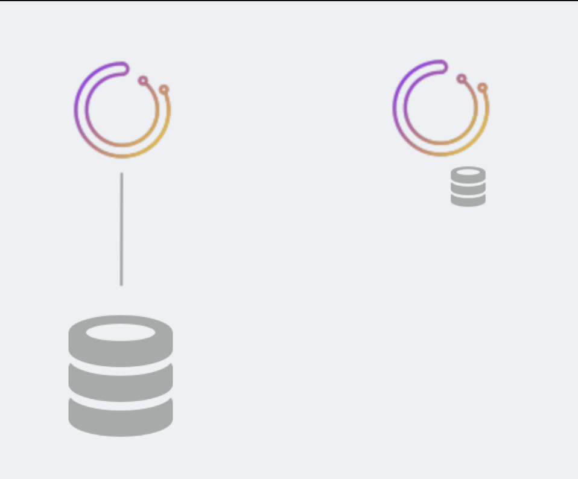
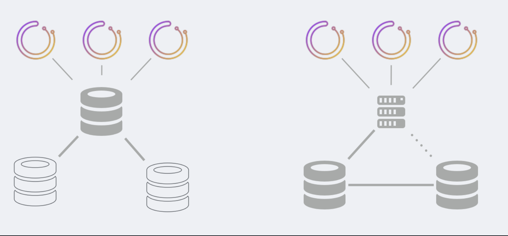
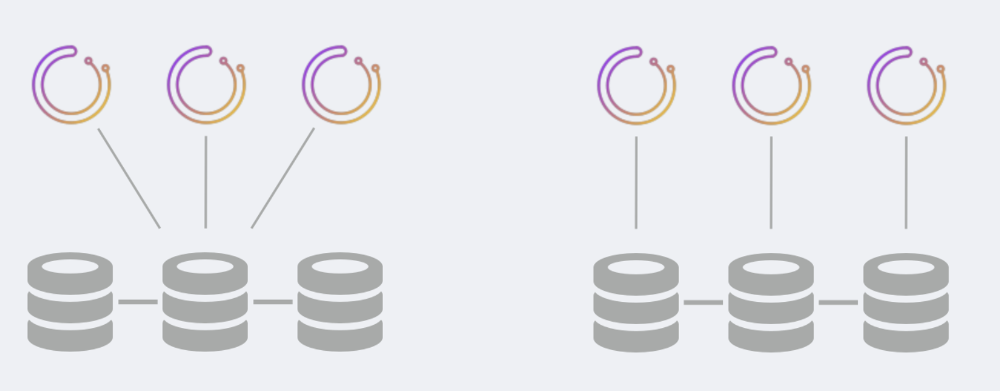
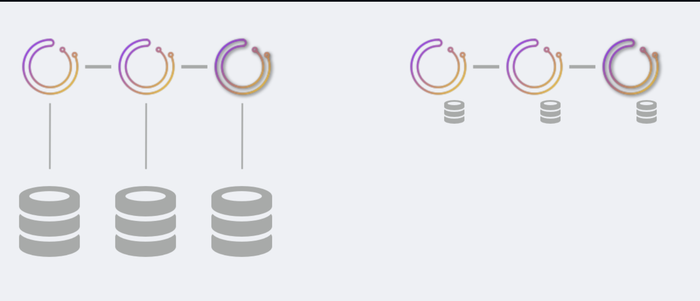
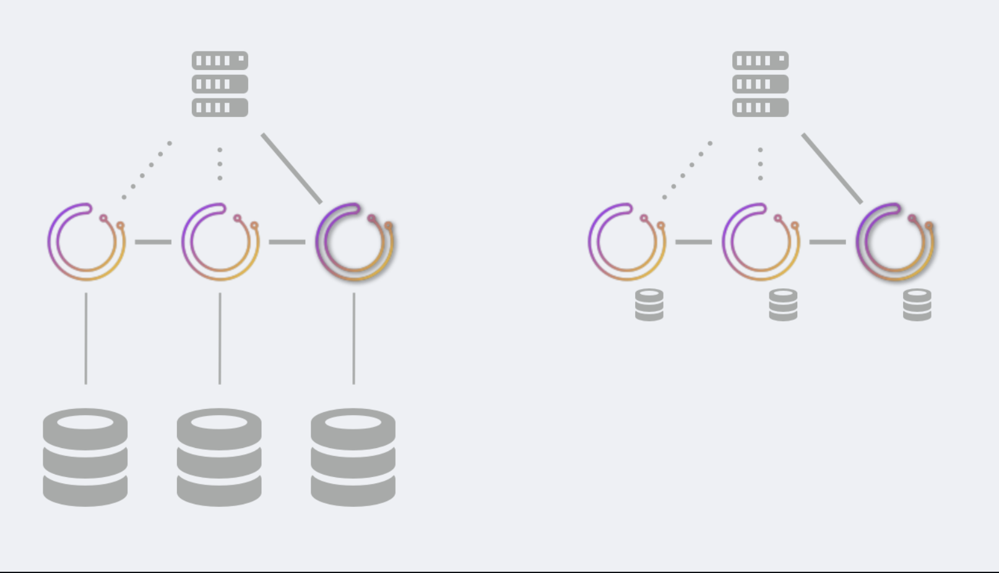

# 高可用性

orchestrator作为高可用性服务运行。本文档列出了为orchestrator实现HA的各种方法，以及less较少/not不 高度可用的设置。

### TL;DR：获得HA的方法

HA是通过可选择以下其中一项：

orchestrator/raft设置，其中orchestrator节点通过raft协议进行通信。
每个orchestrator节点都有一个私有数据库后端(https://github.com/openark/orchestrator/blob/master/docs/high-availability.md#ha-via-raft)，MySQL或sqlite。
另请参见orchestrator/raft文档(https://github.com/openark/orchestrator/blob/master/docs/raft.md)

共享后端(https://github.com/openark/orchestrator/blob/master/docs/high-availability.md#ha-via-shared-backend)设置。多个orchestrator节点都与同一后端通信，该后端可能是Galera/XtraDB集群/InnoDB集群/NDB集群。
同步是在数据库级别完成的。
另请参见：orchestrator/raft与同步复制设置(https://github.com/openark/orchestrator/blob/master/docs/raft-vs-sync-repl.md)

### 可用性类型

您可以根据需要选择不同的可用性类型。
* 无高可用性：最简单、最简单的设置，适用于测试或开发设置。可以使用MySQL或sqlite
* 半HA：后端基于正常的MySQL复制。orchestrator不吃自己的狗粮，无法故障切换自己的后端。
* HA：如上所述；支持无单点故障。不同的解决方案在资源利用率、支持的软件、客户端访问类型等方面有不同的权衡。

下面讨论的是所有选项。

### 无高可用性

此设置适用于CI测试、本地开发机器或其他实验。它是具有单个DB后端的单个orchestrator节点。

数据库后端可以是MySQL服务器，也可以是sqlite数据库，与orchestrator捆绑在一起（无依赖项，无需其他软件）

### 半HA

此设置为orchestrator提供半HA。提供两种变体：

* 多个orchestrator节点与同一后端数据库通信。实现了编排器服务的HA。然而，后端数据库的HA并没有实现。后端数据库可能是具有副本的主数据库，但orchestrator无法吃自己的狗粮并故障切换其后端数据库。

如果后端master挂掉，则需要某人或其他人将orchestrator服务故障转移到升级的副本上。

* 多个orchestrator服务都与代理服务器通信，代理服务器通过基于语句的复制对活动MySQL主设置进行负载平衡。

    * 代理始终指向同一服务器（例如，HAProxy的第一个算法），除非该服务器已挂掉。
    * 活动主控器的死亡会导致配器者和另一个主控器对话，这可能有点落后。orchestrator通常会根据其连续发现的性质自行重新应用丢失的更改。
    * orchestrator查询保证基于语句的复制不会导致重复错误，并且主设置将始终实现一致性。
    * orchestrator将能够恢复后端主机的死亡，即使在RunnEngEngult的中间（恢复将在备用主机上重新启动）。
    * 脑裂是可能的。根据您的设置、物理位置和代理类型，可以有不同的orchestrator服务节点与不同的后端MySQL服务器通信。
      这个场景可以引导two two orchestrator服务，它们认为自己是"active"，它们都将独立地运行故障转移，这将导致拓扑损坏。

要访问orchestrator服务，您可以与任何健康节点通讯。
众所周知，这两种设置都可以在非常大的环境中运行。

### 通过共享后端的HA

HA是通过高可用的共享后端实现的。现有的解决办法是：

* Galera
* XtraDB Cluster
* InnoDB Cluster
* NDB Cluster

在上述所有情况下，MySQL节点都运行同步复制（使用通用术语）。

存在两种变化：

* Galera/XtraDB集群/InnoDB集群使用单个writer节点运行。多个orchestrator节点可能通过代理与单个writer DB通信。
  如果writer数据库失败，后端集群升级另一个数据库作为writer；由您的代理来识别该服务器并将orchestrator的流量定向到升级的服务器。
  
* Galera/XtraDB集群/InnoDB集群以多个写入程序模式运行。一个好的设置会将每个orchestrator节点与一个DB服务器耦合（可能在同一个框中）。
  因为复制是同步的，所以没有脑裂。只有一个orchestrator节点可以成为leader，并且该leader只会在DB节点一致同意的情况下发言。

在此设置中，MySQL节点之间可能存在大量通信量。在跨DC设置中，这可能意味着更大的提交延迟（每次提交可能需要跨DC进行）。

要访问orchestrator服务，您可以与任何健康节点通话。建议您仅通过proxy代理与leader通话（使用/api/leader-check作为代理的HTTP健康检查）。

众所周知，后一种设置在3或5个节点的非常大的环境中运行。

### 经过raft HA

orchestrator节点将通过raft一致性算法直接通信。每个orchestrator节点都有自己的专用后端数据库。这可以是MySQL或sqlite。

只有一个orchestrator节点承担领导责任，并且始终是共识的一部分。但是，所有其他节点都是独立活动的，并且正在轮询您的拓扑。

在此设置中，有：

* 数据库节点之间没有通信。
* orchestrator之间的最小通信。
* *n与MySQL拓扑节点的通信。3节点设置意味着每个拓扑MySQL服务器由3个不同的orchestrator节点独立探测。

建议运行3节点或5节点设置。

sqlite嵌入在orchestrator中，不需要外部依赖项。MySQL在繁忙的设置中优于sqlite。

要访问orchestrator服务，您只能与leader节点通话。

* 使用/api/leader-check作为代理的HTTP运行状况检查。
* 或者使用具有多个orchestrator后端的orchestrator-client(https://github.com/openark/orchestrator/blob/master/docs/orchestrator-client.md)；orchestrator-client将确定领导者的身份，并向领导者发送请求。

orchestrator/raft是一个较新的开发，目前正在生产中进行测试。请阅读orchestrator/raft文档(https://github.com/openark/orchestrator/blob/master/docs/raft.md)了解所有含义

