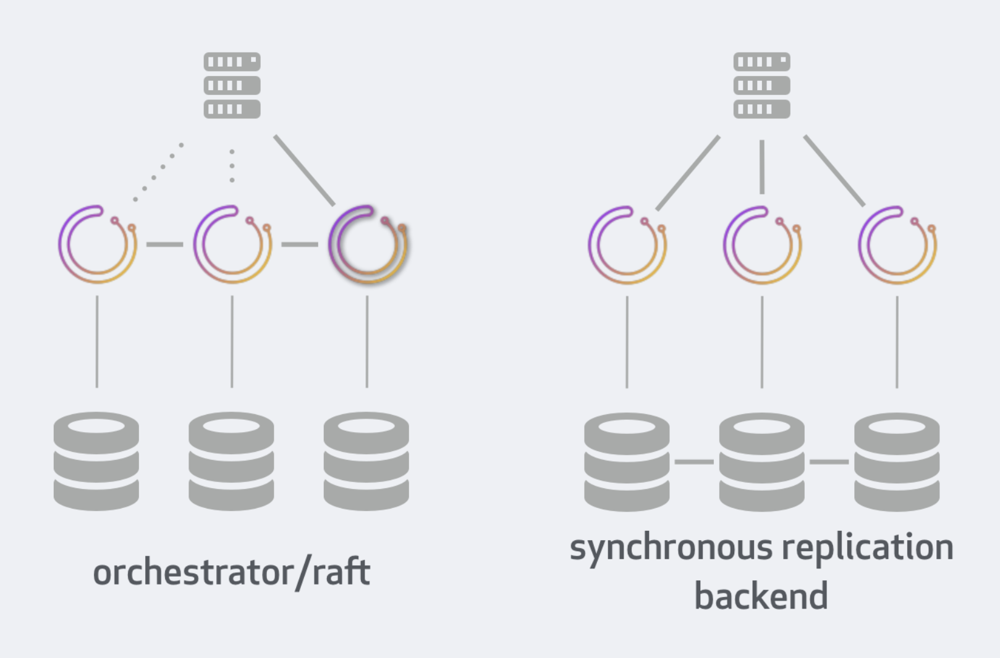

# orchestrator/raft 与 同步复制设置

这比较了两种高可用性部署方法的部署、行为、限制和好处：orchestrator/raft与orchestrator/[galera | xtradb cluster | innodb cluster]

我们将假设并比较：

* 3数据中心设置（可用性区域可算作data-center）
* 3节点orchestrator/raft设置
* multi-writer galera|xtradb集群| innodb集群上的3节点orchestrator（集群中的每个MySQL都可以接受写入）
* 能够运行HTTP或mysql运行状况检查的代理
* MySQL、MariaDB、Percona Server都被认为是MySQL。

|  比较 | orchestrator/raft | 同步复制后端 | 
|  ----  | ----  | ---- |
| 一般线路  | 每个orchestrator节点都有一个专用后端数据库；orchestrator节点通过raft协议进行通信  | 每个orchestrator节点连接到同步复制组中的不同MySQL成员。orchestrator节点彼此不通信。 | 
| 后端DB  | MySQL 或 SQLite | MySQL |      
| 后端DB依赖  | 如果无法访问自己的私有后端数据库，服务将陷入panics恐慌  | 如果无法访问自己的专用后端数据库，则服务不正常 |
| DB 数据 | 跨DB后端独立。可能会有所不同，但在一个稳定的系统上，会收敛到相同的总体情况 | 单个数据集，跨数据库后端同步复制。 | 
| DB 访问  | 不要直接写。coordinating/cooperating协调/合作时，只有raft节点访问后端数据库。否则可能会导致不一致。Reads是可以的。  |  可直接访问和写入；所有orchestrator nodes/clients节点/客户端都看到完全相同的图片。 | 
| Leader领导与动作 | 单一leader。只有leader负责恢复。所有节点都运行发现（探测）和自我分析 |  单一leader。只有leader负责发现（探测）、分析和恢复。   | 
| HTTP访问 | 只能访问leader（可由代理或orchestrator-client强制） |  可以访问任何健康节点（可以通过代理强制）。为了保持读一致性，最好仅与leader交谈（可由代理或orchestrator-client强制执行）   | 
| 命令行 | HTTP/API访问（如curl、jq）或orchestrator客户端脚本，该脚本使用熟悉的命令行界面封装常见的HTTP/API调用  |  HTTP/API 和/或 orchestrator-client脚本或orchestrator。。。命令行调用。   | 
| 安装 | 仅服务节点上的orchestrator服务。orchestrator-client脚本随处可见（需要访问HTTP/API）。 |  服务节点上的orchestrator服务。orchestrator-client脚本随处可见（需要访问HTTP/API）。orchestrator客户端anywhere（需要访问后端数据库）   | 
| 代理 |  HTTP。必须仅将流量定向到领导（/api/leader-check）|  HTTP。必须仅将流量定向到健康节点（/api/status）；最好只将流量定向到leader节点（/api/leader-check）   | 
| 无代理 | 将orchestrator-client与所有orchestrator后端一起使用。orchestrator-client将把流量定向到master服务器。 |  将orchestrator-client与所有orchestrator后端一起使用。orchestrator-client将把流量定向到master服务器。   | 
| 跨DC | 每个orchestrator节点（以及专用后端）可以在不同的DC上运行。节点通信不多，通信量低。 |  每个orchestrator节点（以及关联的后端）可以在不同的DC上运行。orchestrator节点不直接通信。MySQL组复制很健谈。通信量主要与拓扑大小和轮询率成线性关系。写入延迟。   | 
| 探查 | 所有orchestrator节点探测的每个拓扑服务器 |  单个活动节点探测的每个拓扑服务器   | 
| 失效分析 | 由所有节点独立执行 | 仅由leader执行（DB是共享的，因此所有节点都可以看到完全相同的图片） | 
| 故障切换 | 仅由leader节点执行 |  仅由leader节点执行   | 
| 抗失败能力 | 1个节点可能会停机（5节点群集上有2个） |  1个节点可能会停机（5节点群集上有2个）   | 
| 节点从短路故障中恢复 | 节点重新加入集群，使用更改进行更新。 | DB节点重新加入集群，使用更改进行更新。    | 
| 节点从长时间停机中恢复 | 必须从健康节点克隆数据库。 |  取决于您的MySQL后端实现。可能是从备份进行SST/restore。   | 

## 考虑因素

以下是选择这两种方法的注意事项：
    
    * 您只有一个数据中心（DC）：选择共享数据库或更简单的设置(https://github.com/openark/orchestrator/blob/master/docs/high-availability.md)
    * 您对Galera/XtraDB Cluster/InnoDB Cluster很满意，并且能够自动设置和维护它们：选择共享数据库后端。
    * 您有高延迟跨DC网络：选择orchestrator/raft。
    * 您不想为orchestrator后端分配MySQL服务器：选择orchestrator/raft with SQLite后端
    * 您有数千个MySQL boxes框：选择其中一个，但选择比SQLite更具写入性能的MySQL后端。
    
## 笔记

* 另一种同步复制设置是单个写入程序的同步复制设置。
  这将需要在orchestrator节点和底层集群之间添加一个代理，上面没有考虑到这一点。
