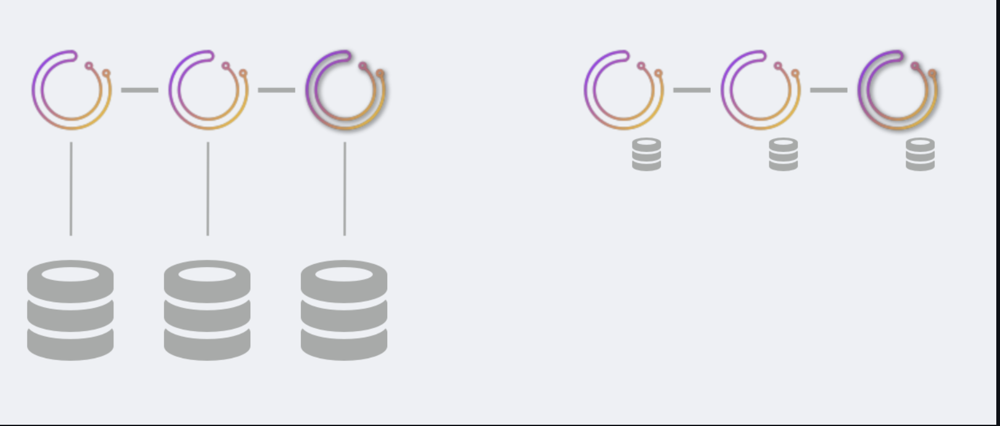
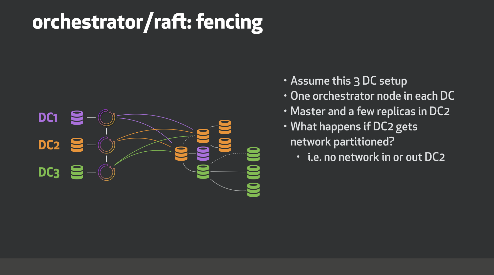
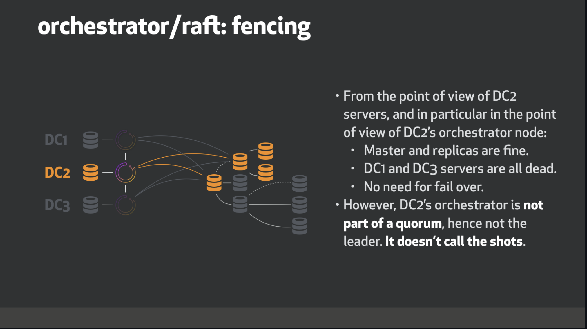
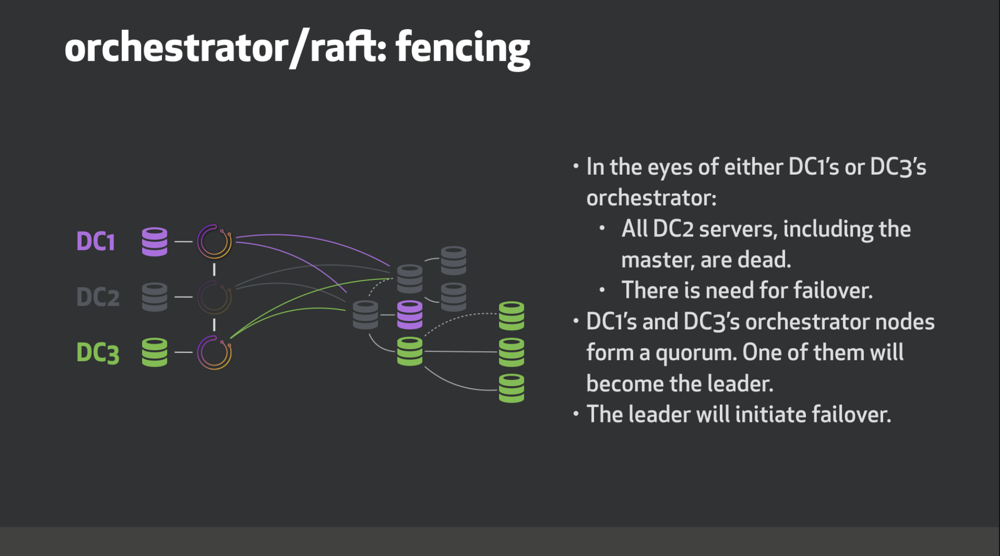
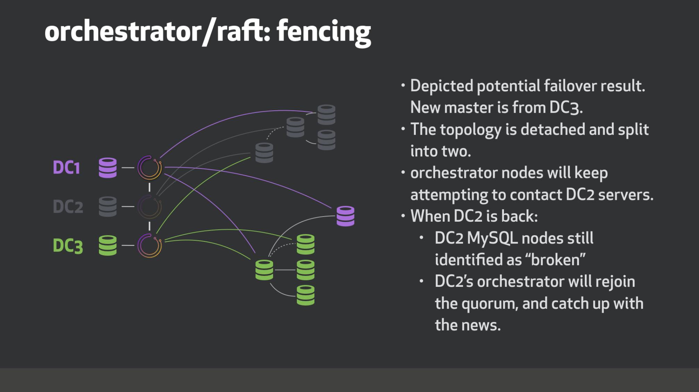

# Orchestrator/raft, 集群共识

orchestrator/raft是一种部署设置，其中多个orchestrator节点通过raft一致协议相互通信。

orchestrator/raft部署既解决了orchestrator自身的高可用性，也解决了网络隔离问题，特别是跨数据中心网络分区/围栏partitioning/fencing问题。

## 非常简短的raft特性概述

通过使用一致协议，orchestrator节点能够选择具有仲裁的leader，这意味着它不是孤立的。
例如，考虑3节点 orchestrator/raft设置。通常，三个节点将相互聊天，其中一个节点将是稳定的当选leader。
然而，在面对网络分区时，假设节点n1与节点n2和n3分开，则可以保证前导节点为n2或n3。n1无法领先，因为它没有仲裁（在3节点设置中，仲裁大小为2；在5节点设置中，仲裁大小为3）

这在跨数据中心（DC）设置中非常有用。假设您设置了三个orchestrator节点，每个节点位于其自己的DC上。
如果一个DC被隔离，则可以保证活动的orchestrator节点将是具有一致性的节点，即从隔离的DC外部操作。

## orchestrator/raft 设置技术细节

另请参见：orchestrator/raft与同步复制设置(https://github.com/openark/orchestrator/blob/master/docs/raft-vs-sync-repl.md)

#### Service节点

您将设置3个或5个（建议raft节点数）orchestrator节点。其他数字也是合法的，但您至少需要3个。

此时，orchestrator节点无法动态加入集群。节点列表的预配置如下所示：

     "RaftEnabled": true,
      "RaftDataDir": "/var/lib/orchestrator",
      "RaftBind": "<ip.or.fqdn.of.this.orchestrator.node>",
      "DefaultRaftPort": 10008,
      "RaftNodes": [
        "<ip.or.fqdn.of.orchestrator.node1>",
        "<ip.or.fqdn.of.orchestrator.node2>",
        "<ip.or.fqdn.of.orchestrator.node3>"
      ],

#### 后端DB

每个orchestrator节点都有自己的专用后端数据库服务器。这将是：

MySQL后端数据库（不需要复制设置，但如果此服务器有副本，则可以）

作为部署建议，此MySQL服务器可以在同一orchestrator节点主机上运行。

SQLite后端数据库。使用：

     "BackendDB": "sqlite",
     "SQLite3DataFile": "/var/lib/orchestrator/orchestrator.db",
      
orchestrator与sqlite捆绑在一起，不需要安装外部依赖项。

#### Proxy: leader

只有leader才能进行更改。
    
通过在orchestrator服务上设置HTTP代理（例如HAProxy），最简单的设置是仅将流量路由到leader。

请参阅orchestrator-client部分以了解替代方法

* 使用/api/leader-check作为健康检查。在任何给定的时间，最多有一个orchestrator节点将使用HTTP 200/OK 回复此检查；
其他人将使用HTTP 404/Not found进行响应。

    * 提示：您可以使用，例如，/api/leader-check/503 is，您明确希望获得503响应代码，或类似的任何其他代码。
    
* 仅将流量定向到通过此测试的节点

例如，这将是HAProxy设置：

    listen orchestrator
      bind  0.0.0.0:80 process 1
      bind  0.0.0.0:80 process 2
      bind  0.0.0.0:80 process 3
      bind  0.0.0.0:80 process 4
      mode tcp
      option httpchk GET /api/leader-check
      maxconn 20000
      balance first
      retries 1
      timeout connect 1000
      timeout check 300
      timeout server 30s
      timeout client 30s
    
      default-server port 3000 fall 1 inter 1000 rise 1 downinter 1000 on-marked-down shutdown-sessions weight 10
    
      server orchestrator-node-0 orchestrator-node-0.fqdn.com:3000 check
      server orchestrator-node-1 orchestrator-node-1.fqdn.com:3000 check
      server orchestrator-node-2 orchestrator-node-2.fqdn.com:3000 check
      
#### Proxy: raft节点健康的

放宽上述限制。

健康的raft节点会将您的请求反向代理给leader。你可以选择（这对于kubernetes设置来说是可取的）与任何健康的raft成员交谈。

您不能访问不健康的raft成员，即与仲裁隔离的节点。

* 使用/api/raft-health标识节点是正常raft组的一部分。
* HTTP 200/OK 响应将该节点标识为健康组的一部分，您可以将流量定向到该节点。
* HTTP 500/Internal Server Error 表示该节点不是正常组的一部分。
  请注意，在启动之后以及在选出leader之前，可能会有一段时间所有节点都报告为不健康。
  请注意，在领导人再次当选时，您可能会观察到一段短暂的时间，其中所有节点都报告为不健康。

#### orchestrator-client

代理方法的替代方法是使用orchestrator-client。
orchestrator-client是一个包装器脚本，它通过HTTP API访问orchestrator服务，并向用户提供命令行界面。

可以向orchestrator-client提供所有orchestrator API端点的完整列表。
在这种情况下，orchestrator-client将确定哪一个端点是领导者，并在该端点上引导请求。

例如，我们可以设置：

    export ORCHESTRATOR_API="https://orchestrator.host1:3000/api https://orchestrator.host2:3000/api https://orchestrator.host3:3000/api"
    
将首先检查对orchestrator-client的调用

否则，如果您已经有代理，orchestrator-client也可以使用代理，例如：

    export ORCHESTRATOR_API="https://orchestrator.proxy:80/api"

## orchestrator/raft设置的行为和含义

* 在raft设置中，每个orchestrator节点独立运行所有服务器的查找。这意味着在三节点设置中，三个不同的orchestrator节点将独立访问每个MySQL拓扑服务器。

* 在正常情况下，三个节点将看到或多或少相同的拓扑图。但他们每个人都有自己的独立分析。

* 每个orchestrator节点都会写入自己的专用后端数据库服务器（无论是MySQL还是sqlite）

* orchestrator节点的通信量最小。他们不共享发现信息（因为他们各自独立发现）。相反，leader与其他节点共享截获的用户指令，例如：

    * begin-downtime
    * register-candidate
    等

    leader还将教育其追随者持续的失败。
    orchestrator节点之间的通信与事务性数据库提交无关，并且是稀疏的。

* 所有用户更改都必须经过leader，特别是通过HTTP API。您不能直接操作后端数据库，因为这样的更改不会发布到其他节点。
* 因此，在orchestrator/raft上，可能无法在命令行模式下使用orchestrator可执行文件：当启用raft模式时，尝试运行orchestrator cli将拒绝运行。
  允许通过cli运行某些命令的工作正在进行中。

* 一个实用程序脚本orchestrator-client可用，它提供与命令行orchestrator类似的接口，并使用和操作HTTP API调用。
* 您将只在orchestrator服务节点上安装orchestrator二进制文件，而不在其他位置安装。orchestrator-client脚本可以安装在您希望安装的任何位置。
* 单个orchestrator节点的故障不会影响orchestrator的可用性。在3节点设置中，最多一台服务器可能会失败。在5节点设置中，2个节点可能会失败。
* 没有后端数据库，orchestrator节点无法运行。对于sqlite后端，这是微不足道的，因为sqlite运行时嵌入了orchestrator。
  使用MySQL后端，如果在一段时间内无法连接到后端数据库，orchestrator服务将退出。

* orchestrator节点可能已关闭，然后返回。它将重新加入orchestrator，并接受它在外出时错过的任何事件。
节点离开多久并不重要。如果它没有相关的本地raft log/snapshots日志/快照，另一个节点将自动向其提供最近的快照。

* 如果orchestrator服务不能加入raft组，它将退出。

另请参见通过orchestrator/raft使用键值存储的主发现。(https://github.com/openark/orchestrator/blob/master/docs/kv.md#kv-and-orchestratorraft)

## orchestrator/raft的主要优势

* 高度可用
* 一致性：故障切换由作为仲裁成员的领导节点进行（非隔离）
* 支持SQLite（嵌入式）后端，虽然支持，但不需要MySQL后端。
* 跨节点通信少；适用于高延迟跨DC网络

## DC示例

考虑这个例子三个数据中心，DC1，DC2和DC3。我们使用三个节点运行orchestrator/raft，每个数据中心一个节点

当DC2被网络隔离时会发生什么？

## 规划图

仍在进行中，有待完成：
* 故障检测需要仲裁协议（即，需要由多个orchestrator节点分析DeadMaster），以便启动故障切换/恢复(failover/recovery)。
* 支持共享探测（与上述相互排斥）：leader将在所有节点之间划分要探测的服务器列表。可能由数据中心负责。
  这将减少探测负载（每个MySQL服务器将由单个节点而不是所有节点探测）。所有orchestrator节点将看到与独立视图相反的相同图片。

