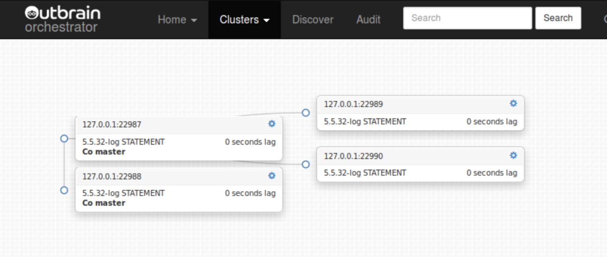

# 使用Web界面

    以下假设您已作为web/API服务执行。打开浏览器并将其指向http://your.host:3000. 
    如果一切顺利，您将看到以下欢迎页面：
    

    
如果这是您第一次使用orchestrator，那么您应该从teaching it教授它开始。orchestrator需要知道您有哪些复制拓扑。web界面通过"discover发现"页面提供此功能。

从每个复制拓扑中，选择一个服务器（可以是主服务器或副本），并让orchestrator知道此服务器侦听的主机名和端口。
Orchestrator将递归地上下搜索复制以映射整个拓扑。这可能需要几分钟的时间，在此期间，orchestrator将遇到的服务器连接到子拓扑中，并最终连接到最终拓扑中。

您可以手动输入任意数量的服务器（在拓扑inside内部或outside外部）。orchestrator第一次调查时，只能访问当前正在复制的副本。
所以，如果您知道有一些复制副本暂时关闭，您将需要手动添加它们，或者，如果您希望看到自动化工作，只需等待它们启动，此时orchestrator将自动找到它们。

一旦orchestrator熟悉服务器，它就不在乎服务器是否滞后、不可复制或不可访问。
服务器仍然是上次看到它的拓扑的一部分。这有一个超时：如果在UnseennistanceTargetHours未看到服务器，它将自动被遗忘（假定已死亡）。
同样，如果它突然恢复生命，并连接到一个已知的拓扑结构，它会自动被重新发现。

Orchestrator解析从用户或复制拓扑本身获得的每个输入的CNAME。这是为了避免歧义或隐式重复。

一旦orchestrator熟悉拓扑，您就可以通过集群页面查看和操作它。单击导航栏上的"Cluster群集"下拉列表以查看可用的群集。

每个拓扑都与集群名称相关联，集群名称（当前）以拓扑的主节点命名。

集群页面是最有趣的地方。Orchestrator基于D3小部件，以一个易于遵循的树信息图的形式呈现集群。子树是可折叠的。

树中的每个节点都表示一个MySQL实例，列出其完全限定名、版本、二进制日志格式和复制延迟。

请注意，每个服务器的右侧都有一个设置图标。单击此图标将打开一个模式，其中包含该服务器上的一些额外信息以及要执行的操作。

该模式允许您在实例上开始/终止维护模式；执行即时刷新（默认情况下，每分钟轮询一次实例-这是可配置的）；
停止/启动复制；忘记该实例（如果仍然连接到拓扑，可能会在一分钟后重新发现）。

拓扑可以重构：副本可以通过拖放移动。开始拖动实例：所有可能的可拖放目标立即显示为绿色。您可以将实例变成所有可拖放目标的副本。

主拓扑可以通过将一个主拓扑拖到它的一个副本上来创建，使两个副主拓扑都成为主拓扑。

复杂的重构是通过执行多个这样的步骤来完成的。您可能需要拖放实例三到四次，才能将其置于"remote远程"位置。

Orchestrator将在您的实例或其目标主机出现问题（延迟过多、不复制等）时禁止删除实例，从而确保您的安全。如果发现更深的块，例如目标没有二进制日志，它可能允许删除，但仍会中止操作。

开始拖动：可能的目标颜色为绿色

**移动你的目标并删除:**

**拓扑重构:**

**将主机拖动到其复制副本上会形成共同主机（master-master）拓扑：**

**共主拓扑:**

Orchestrator直观地指示与复制和可访问性相关的问题：副本延迟、复制不工作、实例长时间未访问、实例访问失败、实例正在维护。

"问题"下拉列表在所有页面上都可用，并指示所有拓扑中当前已知的所有问题：

Audit设计页面显示通过orchestrator执行的所有操作：副本移动、检测、维护等（当前未审计的 START SLAVE和STOP SLAVE）。

  